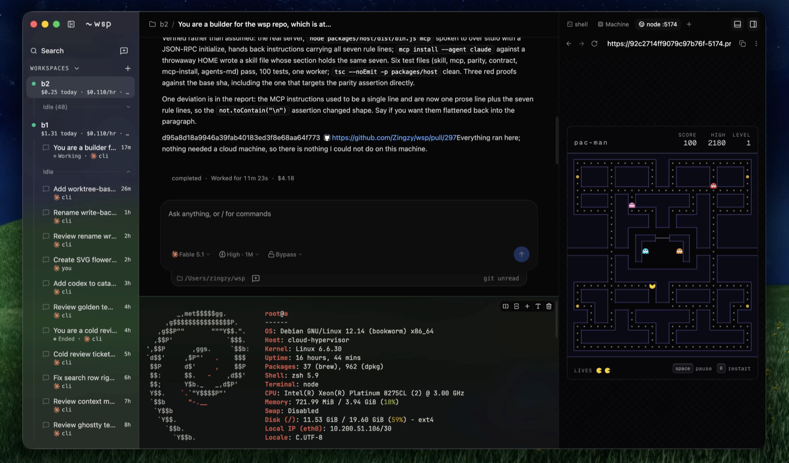
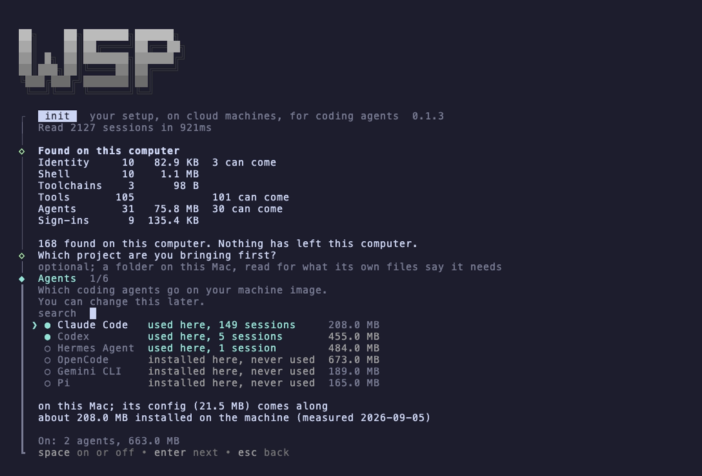

# wsp

Your setup, on cloud machines, for coding agents.

wsp reads your computer once, builds a machine that has what it has (your agents, your tools, your sign-ins), and forks workspaces from it in about twenty seconds. Coding agents work inside those workspaces as threads. You read and answer them from the app, the command line, or another agent over MCP.



## What it does

- **One image of your machine.** The agents you use, the tools they run, your logins, sealed once into a golden image on the machine provider. Rebuild it when your setup changes.
- **Forks in seconds.** Every workspace is a fork of that image, with your setup already there. Forks are live clones: what was running on the source is running on the fork.
- **Agents as threads.** Claude Code and Codex run headless on the machine. Start a thread with a task, read its reply, send the next message, stop it. Threads get real titles and you can rename them, in wsp and in the agent's own session list.
- **Agents starting agents.** An agent on your computer drives wsp over MCP: it forks a workspace, opens a Claude Code thread there, starts a Codex thread beside it, reads both back. Everything it does shows in your sidebar.
- **The machine, in the app.** A terminal that uses your Ghostty config, the ports it listens on as browser tabs, its processes, its files, its cost and state.
- **Naps and wakes.** An idle workspace naps with its RAM intact and wakes on the next message. A machine the provider loses is rebuilt from the image with your files back.
- **Your keys never leave your computer.** wsp runs on your computer and talks to the provider with your key. There is no hosted service in between.

## Before you start

- Node 22 or newer, on macOS or Linux.
- A [Solari](https://console.getsolari.com) account and API key. Solari provides the machines; they cost money while they run and nap on their own when idle.
- A way for Claude Code to sign in: an Anthropic API key, or a Claude subscription you log in with on the machine during the first run. Codex signs in the same way.

## Install

```sh
npm i -g @zingzy/wsp
```

### Let your agent set it up

Give your agent the wsp tools, then ask it to set you up:

```sh
wsp mcp install --agent claude     # or codex, gemini, opencode
```

Then, in that agent: *"set up wsp for me"*. It reads what you use on this computer, writes the recipe, asks you about the heavy rows, builds the image, and hands you each sign-in link as the build reaches it. Sign-ins finish in your browser.

### Or do it yourself

```sh
wsp init
```

Six screens: the agents on this computer, their tools, what else to bring from this Mac, sign-ins, wsp for your own agents, and the build. Everything is ticked from what you actually use; Enter through every screen takes the defaults. Nothing leaves your disk before the confirm.



Useful flags: `--yes` takes every default and asks nothing. `--recipe <path>` builds from a recipe an agent wrote. `--non-interactive --json` prints one JSON line per sign-in and build stage, for an agent driving the setup. `--state <path>` and `--port <n>` keep a second setup apart from the first.

## Every day

```sh
wsp up
```

serves the app at `http://127.0.0.1:4400` and the runtime behind it. `wsp up --service` keeps it up across logins. The desktop app is the same host and app in one window; bundles for macOS and Linux are on the [releases page](https://github.com/Zingzy/wsp/releases).

The command line and the MCP tools are the same verbs: `new`, `fork`, `snapshot`, `pause`, `threads`, `thread new`, `send`, `exec`, `import`, `export`, `rename`. `wsp --help` lists them; the app's palette runs them too.

<!-- unsigned:start -->
### Opening a downloaded bundle

The bundles are not signed yet, so the first open of `wsp.app` is refused: right click it in Finder, pick Open, and pick Open again in the dialog. Every open after that is a double click.

The Linux AppImage needs the run bit before it starts: `chmod +x wsp-*.AppImage`.
<!-- unsigned:end -->

## What is next

Your own computer as a workspace, so agents can start each other locally as well as in the cloud. Spaces: one workspace at a time in the sidebar, with its own tint. Images in threads. Pi and Gemini threads.

## Building from source

```sh
git clone https://github.com/Zingzy/wsp.git && cd wsp
pnpm install && pnpm build
pnpm wsp init
```

`pnpm test` runs without any key. The laws the code follows are in [CONTRIBUTING.md](CONTRIBUTING.md); how a browser reaches a workspace is in [docs/reach.md](docs/reach.md); cutting a release is [docs/release.md](docs/release.md).

## Issues

[github.com/Zingzy/wsp/issues](https://github.com/Zingzy/wsp/issues). Say what you ran, what you saw, and the output of `wsp --version`. Never paste a key.

## License

AGPL-3.0-only. See [LICENSE](LICENSE) and [THIRD_PARTY_NOTICES](THIRD_PARTY_NOTICES).
