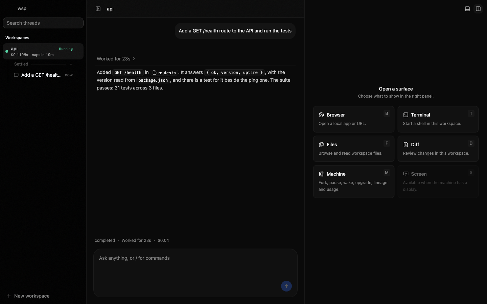
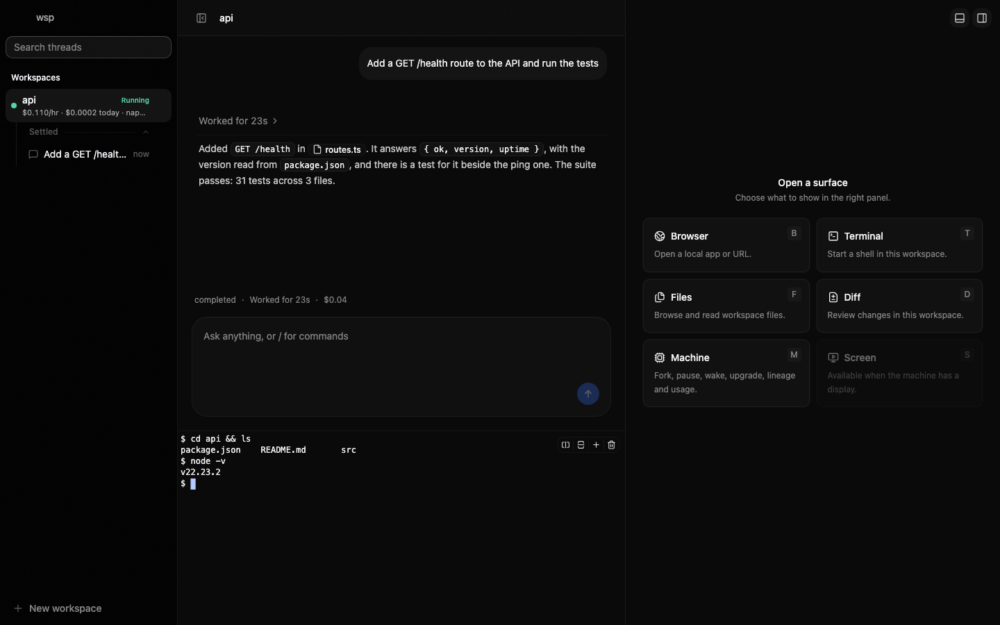
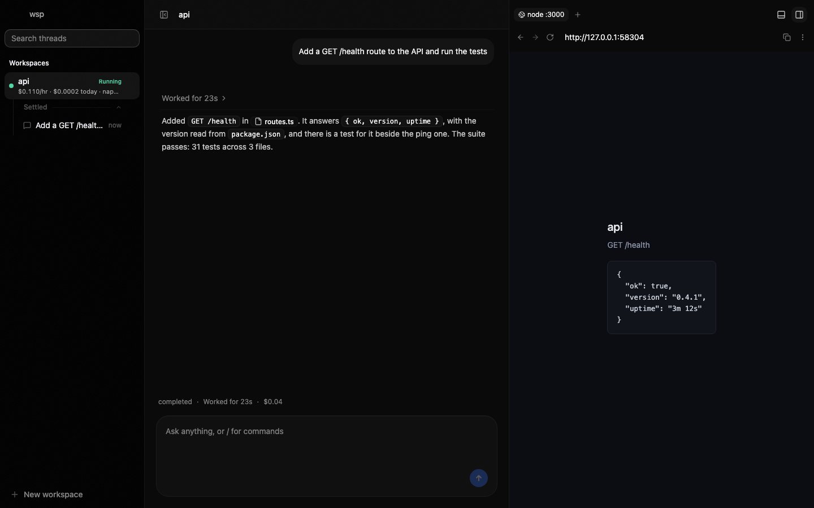
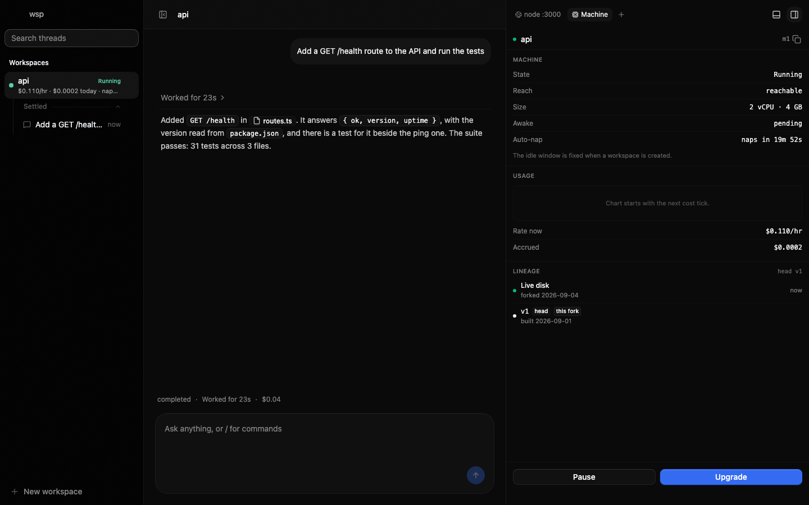

# wsp

Your setup, on cloud machines, for coding agents.

wsp builds a cloud machine that has what your computer has: the coding
agents you use, the tools they need, your sign-ins. It seals that machine
as a golden image and forks workspaces from it in seconds. Agents work
inside the workspaces. You read and answer them from an app on your own
computer, from the command line, or from another agent over MCP. There is
no hosted service in between: wsp runs on your computer and talks straight
to the machine provider with your key.

Workspaces nap when idle and wake with RAM intact. If a paused machine
disappears, wsp rebuilds it from the golden image and puts your files back.



*The shell. Workspaces and their threads on the left, the thread with its composer in the center, the right panel's surface picker.*



*The terminal drawer under the thread: a shell on the workspace, with tabs and splits.*



*The browser pane: the workspace's listening ports as local servers, opened in place.*



*The machine panel: state, reach, size and auto-nap, spend so far, the golden lineage, pause and upgrade.*

## Before you start

- **Node 22 or newer** on your computer.
- **A Solari account and API key.** Solari provides the machines. Make a
  key at [console.getsolari.com](https://console.getsolari.com). wsp asks
  for it once on the first run and offers to save it in `~/.wsp/.env`. Machines cost
  money while they run; a workspace that sits idle naps on its own.
- **A way for Claude to sign in.** Either an Anthropic API key, which wsp
  asks for next to the Solari key and copies into every workspace, or a
  Claude subscription, in which case skip the key and sign in on the machine
  when the first run asks. The login is sealed into the golden image, so it
  happens once.
- Other agents (Codex, Gemini, OpenCode, pi, Hermes) sign in the same way,
  in your terminal, during the first run.

## Install and first run

```sh
npm i -g @zingzy/wsp
wsp init
```

The package is `@zingzy/wsp`; the command it puts on your path is `wsp`. To try it
once without installing, `npx @zingzy/wsp init` runs the same first run, but nothing
is left on the path afterwards.

`wsp init` reads your computer: which agents are installed, what they used
(names and counts from their session histories, nothing else), and which
tools and sign-ins go with them. It then walks three screens:

1. **Agents.** The six the catalog knows, with the ones on your computer
   ticked.
2. **What they need.** One line of counts and one line of disk; the left
   and right arrow keys unfold the tool rows under them.
3. **Sign-ins and keys.** Logins sign in on the machine after the build;
   keys are ticked to copy.

One summary, one confirm. Then it boots the first machine, installs what
you ticked, runs each sign-in in your terminal, asks for each secret it cut
from your shell files, and seals the golden image when you press Enter.
It forks your first workspace from that image and opens the app on it at
`http://127.0.0.1:4400`. Nothing leaves your disk before the confirm, and
no question is ever asked on the remote machine.

Every prompt has a flag. `--yes` takes every default and asks nothing.
`--recipe <path>` ticks the agents and tools from a recipe that
`wsp recipe` wrote and goes straight to the sign-ins. The recipe is saved
next to the state, so a second golden image is a re-run.

`--non-interactive` asks nothing either, but still runs the sign-ins: each
one prints the page to open on this computer, the code when the flow shows
one, and the command that opens it, then waits for you while it asks the
tool on the machine whether you are through. That is what a run off a
terminal does anyway. `--json` prints each of those as one object on stdout,
and before them every build stage frame as one object too, naming the install
step it belongs to, the command that step runs and its seconds so far, so a
step that has gone quiet reads as a stall and not a hang; every other line
goes to stderr, so an agent can drive the setup and hand you the sign-ins. It
is refused beside `--yes`: that skips the sign-ins, so there would be nothing
left to print.

A run with nobody at a terminal (`--non-interactive`, or no terminal) seals
the golden, records it, and ends: it never serves the app, so it never fights
a host already on the ports, and it forks no workspace unless
`--first-workspace` or `--import` asked for one, so nobody pays for a machine
they did not ask for. Under `--json` the last object names the golden, the
recipe, the `wsp up` to run next and the `wsp new` that forks a workspace. On
a terminal, `--yes` included, the app is served once the golden is recorded,
and the ports are checked before anything is read, so a clash costs nothing
rather than a build.

## Every day after

```sh
wsp up
```

starts the app and the runtime over the golden you sealed, and serves until
you stop it, so closing that terminal takes the app down with it. To have this
computer keep it up instead:

```sh
wsp up --service   # a launchd agent on a Mac, a systemd user unit on Linux
wsp status         # what serves this state file, on which ports, and what keeps it there
wsp down           # stop the service and take it away
```

A service starts without your shell, so its keys have to be in `~/.wsp/.env`
rather than exported. Everything else runs from another terminal while a host
is up, however it was started, and every verb takes `--json` for the raw
protocol values:

| command | what it does |
|---|---|
| `wsp new <name>` | a workspace forked from the golden's head, or with `--from`, from a project golden |
| `wsp snapshot <workspace>` | a project golden: the golden plus the project as it is now, ready to fork |
| `wsp fork <workspace>` | a sibling machine from the source's golden version; `--send "<task>"` opens a thread in it |
| `wsp pause <workspace>` | naps the machine |
| `wsp threads` | every thread: agent, state, who opened it, the folder it works in |
| `wsp thread new --in <workspace> "<task>"` | opens a thread and follows its first turn; `--agent`, `--cwd`, `--notify <thread\|me>` |
| `wsp send <thread> "<message>"` | a message to a thread; steers a running turn or queues behind it, then prints the reply |
| `wsp exec <workspace> -- <command...>` | runs a command on the machine and exits with its code |
| `wsp import <folder> --to <workspace>` | lands a project folder on the machine at its path here; the plan first, `--yes` to move it |
| `wsp export <workspace> <folder>` | brings a project folder and the agent sessions keyed to it home |
| `wsp doctor` | runs the reach loop end to end against one live machine and prints what it measured |

`wsp --help` prints the same list with the flags.

## For agents

An agent on your computer can drive wsp the way you do. One command puts the
wsp MCP server into that agent's own config and the wsp skill into its
skills folder:

```sh
wsp mcp install --agent claude     # or codex, gemini, opencode
```

The MCP tools are the verbs above: `workspaces`, `threads`, `new`,
`snapshot`, `fork`, `pause`, `thread_new`, `send`, `exec`, `export`. A
thread an agent opens shows in your sidebar like any other, and you can read
and answer it there. The skill, `skills/wsp/SKILL.md`, tells the agent what
each verb does, how to build with wsp (a workspace with the repo in it, one
thread per task, review threads, `--notify me` when a turn ends), where a
person has to step in (sign-ins, keys, the machine cap, picking a size), and
what costs what. The server's own instructions are derived from the same
file, so the two cannot drift.

An agent can also prepare the first run. `wsp recipe --out recipe.json`
writes every catalog agent and tool with a tick from what is installed here
and what your agents used. Review it, then run `wsp init --recipe
recipe.json` yourself, because the sign-ins need your terminal.

## Desktop app

The same host and app in one Electron window, the host started for you. It
reads the same `~/.wsp` state as the command line, so run `wsp init` once
first; opened before that, it shows a page saying what is missing. Bundles
are on the [GitHub Releases](https://github.com/Zingzy/wsp/releases) page
for macOS (Apple silicon and Intel) and Linux (AppImage). They are not
signed:

- **macOS** refuses to open an unsigned app on the first try. Right-click
  the app and choose Open, or clear the quarantine flag once:
  `xattr -dr com.apple.quarantine /Applications/wsp.app`.
- **Linux** needs the AppImage marked executable: `chmod +x wsp-*.AppImage`.

## Your keys stay on your computer

The runtime runs inside the `wsp` process on your computer. Your provider
key travels only in direct requests from that process to the provider's API,
and your Anthropic key or Claude login only to the machines you build. The
app and the WebSocket API bind `127.0.0.1` only. Keys are read from the
environment, then `./.env`, then `~/.wsp/.env`; state is one JSON file,
`~/.wsp/state.json`, or `./.wsp/state.json` in a checkout with a `.env`.
One state file belongs to one computer.

## Building from source

```sh
git clone https://github.com/Zingzy/wsp.git && cd wsp
pnpm install && pnpm build
pnpm wsp init
```

`pnpm wsp <anything>` runs the checkout's own `wsp`. The tests run without
any key (`pnpm test`); the live tests, which create real machines, run only
under `WSP_LIVE=1` and are described in [docs/canary.md](docs/canary.md).
How a browser reaches a workspace, and what one measured run of `wsp doctor`
looks like, is in [docs/reach.md](docs/reach.md). Cutting a release is
[docs/release.md](docs/release.md). The laws the code follows are in
[CONTRIBUTING.md](CONTRIBUTING.md).

| package | what it is |
|---|---|
| `@wsp/protocol` | zod schemas for every wire message, and the one place text is formatted |
| `@wsp/catalog` | the agents and tools wsp can put on a machine: install roads, sign-ins, config paths |
| `@wsp/collect` | reads your computer: installed tools, session histories, shell files, logins |
| `@wsp/engine` | machine backends, workspace lifecycle, golden images, vault |
| `@wsp/daemon` | in-guest daemon: ptys, port watch, inbox, process manifest |
| `@wsp/adapter-claude` | drives claude headless inside a workspace |
| `@wsp/adapter-codex` | drives codex headless inside a workspace |
| `@wsp/runtime` | embeddable runtime: workspaces, sessions, events over WebSocket |
| `@wsp/host` | the `wsp` command: embedded runtime, the app, the verbs, the MCP server |
| `@wsp/web` | the app |
| `@wsp/desktop` | the Electron shell around the host and the app |
| `@wsp/wspx` | a development-only command line over the same runtime and state file |
| `@zingzy/wsp` | what npm publishes: the host, the app and the daemon in one bundle |

## Issues

File bugs and requests at
[github.com/Zingzy/wsp/issues](https://github.com/Zingzy/wsp/issues). Say
what you ran, what you saw, and the output of `wsp --version`. Never paste
a key.

## License

AGPL-3.0-only. See [LICENSE](LICENSE). Code adapted from other projects is
listed with its own license in
[THIRD_PARTY_NOTICES](THIRD_PARTY_NOTICES).
