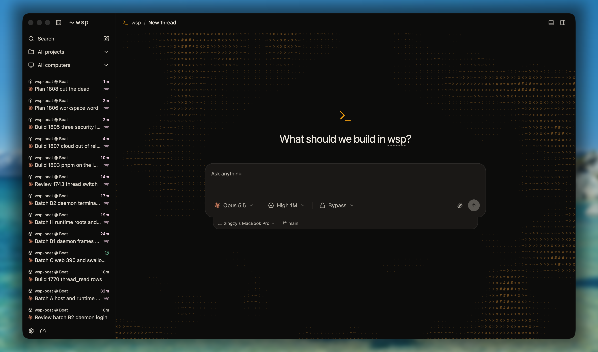
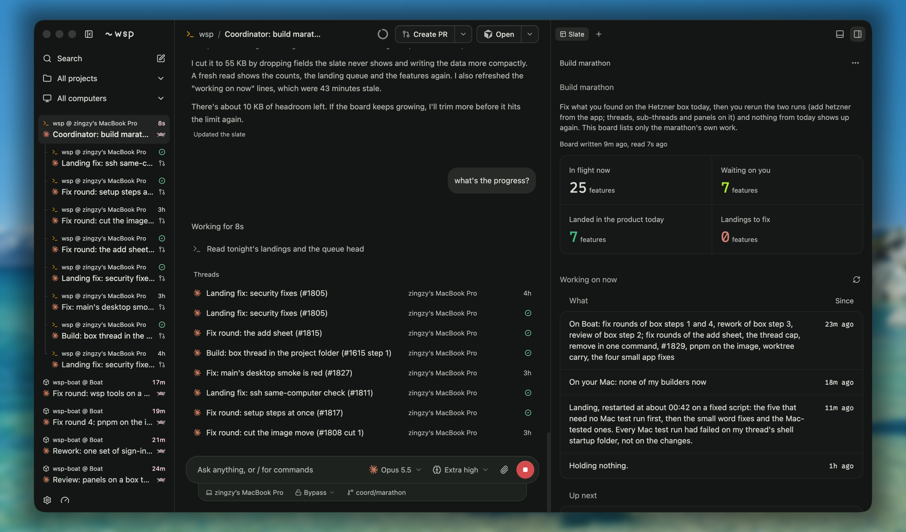
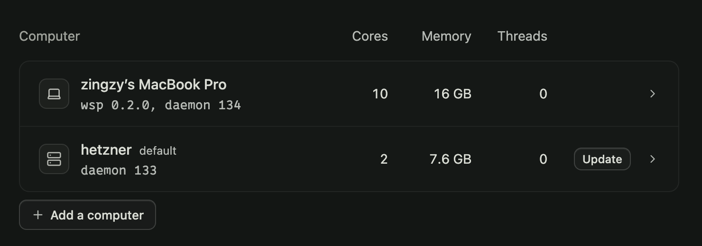

# wsp

Your setup, on your computers, for coding agents.

The site is [usewsp.com](https://usewsp.com). The docs are [wsp.apidocumentation.com](https://wsp.apidocumentation.com).

wsp runs coding agents (Claude Code, Codex, OpenCode, Cursor) as threads on your own computers: the Mac you sit at, and any Linux box you add over ssh. A thread works in your project's folder, the way the agent would in a terminal there. You start threads, read them and answer them from the app, the command line, or from another agent over MCP, and every one of them shows in the same sidebar.



## What it does

- **Threads in your project.** A thread runs in the project's folder on its computer. Several threads share the folder; a thread on another branch gets a git worktree wsp makes, with your `.env` files and installed dependencies carried in.
- **Any agent, any model.** Pick the agent, the model, how hard it thinks and how far it may go without asking, per thread. Answer its questions and permission prompts from the app.
- **Agents starting agents.** A thread can start threads of its own, with the same agent or another one, beside it in the same folder. They show as its children in the sidebar, and each one's last reply comes back to the thread that started it.
- **Computers you own.** Add a Linux box over ssh and wsp puts your setup on it: your agents, the command-line tools they use, their skills, MCP servers and plugins, your sign-ins and your projects. Then start threads there the same way.
- **Everything about a thread, beside it.** A terminal in its folder, its dev server in a browser tab, its changes with commit, push and pull request, its files, its processes, the computer's load, and the slate: a panel the agent builds for the thread, live, from trackers to forms with buttons.
- **What your agents use.** A usage page with each agent account's plan limits and what was used, by agent, project and computer.
- **Your keys stay on your computers.** The host runs on your Mac, not on a service of ours, and your sign-ins live on the computers that use them.



## Before you start

- macOS, or Linux on x64.
- An agent you already use and are signed in to: Claude Code, Codex, OpenCode or Cursor.
- For a box you add: Linux you can reach over ssh as root, with systemd and cgroup v2.

## Install

```sh
curl --proto '=https' --tlsv1.2 -fsSL https://usewsp.com/install | sh
```

On a Mac this puts wsp.app in Applications and opens it; on Linux it puts the AppImage in `~/Applications`. Either way the `wsp` command lands in `~/.wsp/bin`, on PATH in a new terminal. Each download comes from this repo's releases and is checked against the sha256 GitHub publishes for it. `WSP_VERSION=1.2.3` installs that release; running it again upgrades in place.

The desktop bundles for macOS and Linux are also on the [releases page](https://github.com/wsp-labs/wsp/releases).

With Node 22 or newer, this installs the command line alone:

```sh
npm i -g @wsp-labs/wsp
```

This README describes the next release, 0.3.0. Until it is out, build from source (below) to run what is here.

## First run

Open the app. It finds the agents on your Mac and serves your projects from there. Add a project (any folder, a git repo or not) and start a thread from the composer.

The same from a terminal:

```sh
wsp add ~/code/api                                   # a project: a folder on this computer
wsp run api "fix the flaky terminal test"            # a thread in that folder
wsp run api --branch fix/flaky "write the failing test first"   # a thread in a worktree on that branch
wsp threads                                          # who is working, where, on which branch
```

`wsp send <thread> "<message>"` is a thread's next message and `wsp stop <thread>` ends its turn. `wsp thread read <thread>` prints what it said. The first line that needs a host starts one; `wsp down` stops it.

## Add a computer

In the app: Settings, then Computers, then Add a computer. Name the box as you reach it over ssh (an alias from your `~/.ssh/config` works), and wsp checks it, installs itself there, and sets it up from your Mac's setup or a saved recipe, one step at a time. Or from a terminal:

```sh
wsp add root@my-box
```



`wsp computers` lists your computers; `wsp computers set <computer>` renames one, moves its ssh login, and sets how many threads run there at once. `wsp remove <computer>` takes a box out and removes what wsp put there.

## For your agents

Give your agent the wsp tools and skill:

```sh
wsp mcp install --agent claude     # or codex, gemini, opencode
```

After the agent restarts, it can open threads, start threads on other agents and models beside it, read their replies and send them messages, all of it in your sidebar. In the agent: *"use wsp to start a Codex thread on api that reviews the open pull request"*.

## The command line

```
wsp add <user@host|folder|url>  a computer over ssh, or a project
wsp computers                   your computers: this one, each box you added
wsp remove <computer>           take a computer out
wsp projects                    your projects, each on its computer
wsp threads [<project>]         who is working, in which folder, branch and computer
wsp run <project> "<message>"   an agent works in the project's folder
wsp send <thread> "<message>"   the thread's next message
wsp stop <thread>               end the thread's running turn
wsp delete <thread>             gone with its turns; the folder stays
wsp status                      whether a host serves, and where
wsp mcp                         the verbs as tools for agents on this computer
```

`wsp --help` lists them all, `wsp <verb> --help` gives a verb's flags, and `wsp --help agent` has the ones your agents use. The command line and the MCP tools are the same verbs.

<!-- renames:start -->
### Renamed in 0.3.0

The front page of `wsp --help` is sixteen words on five nouns: image, place, workspace, thread, project. Every command is `wsp <verb> <workspace> ...`, the workspace first. Nothing answers to the old words, so here they are, once.

| was | is |
| --- | --- |
| `wsp thread new --in <workspace> "<task>"` | `wsp run <workspace> "<task>"` |
| the MCP tool `thread_new` | the MCP tool `run` |
| `wsp import <folder> --to <workspace>` | `wsp import <workspace> <folder>` |
| `wsp threads --in <workspace>` | `wsp threads <workspace>` |
| `wsp new --local [name]` | `wsp new <name> --on <place>`, naming the computer you are at |
| `wsp new --ssh <user@host>` | `wsp add user@host` (or an alias from your ssh config), then `wsp new <name> --on <that place>` |
| `wsp init --provider <id>` | `wsp add <id>` |
| `wsp pair`, `wsp devices` | `wsp host pair`, `wsp host devices` |
| `wsp connect <url>` | `wsp login`: a host on your account needs no code |
| `wsp hosts default`, `wsp disconnect` | nothing: a line goes to your account's one host, `--host` names another, and `wsp logout` drops them |
| `wsp relay link`, `wsp relay unlink` | `wsp host link`, `wsp host unlink` |
| `wsp relay hosts`, `wsp host linked`, `wsp host list` | `wsp hosts`, the hosts on your account |
| `wsp relay clients`, `wsp host clients` | `wsp login`, and `wsp logout <id>` to sign one out |
| `wsp up` to get going | nothing: the first command that needs a host starts one, and `wsp down` stops it |
| plain `wsp` serving | plain `wsp` prints the help |

This computer and every computer or provider you add are places, and `wsp places` lists them; `--on <place>` on `wsp new` is the one flag you meet, and only once you have more than one. `wsp add` is the one way a place joins: `wsp add user@host` for a computer over ssh (an alias from your `~/.ssh/config` works as well), `wsp add <provider>` for a provider, `wsp add` alone for the line another computer types. `wsp up` is still there for a host you want to watch in a terminal or one that serves beyond this computer.

Agents on this computer get the new skill the first time the new host starts; a project folder whose `AGENTS.md` carries the old section gets the new one at the next `wsp mcp install` there.
<!-- renames:end -->

<!-- bundles:start -->
### Opening a downloaded bundle

Open the macOS disk image and drag wsp onto the Applications folder it shows. One image holds both Apple silicon and Intel.

<!-- unsigned:start -->
The bundles are not signed yet, so macOS refuses the first open of `wsp.app`. Open it once, dismiss the refusal, then in System Settings under Privacy & Security find the line saying wsp was blocked and pick Open Anyway. Or from a terminal: `xattr -dr com.apple.quarantine /Applications/wsp.app`. Every open after that is a double click.
<!-- unsigned:end -->

Start the Linux AppImage from a terminal in the folder it downloaded to: `chmod +x wsp-*.AppImage && ./wsp-*.AppImage`. A double-click on its icon on Ubuntu's desktop does not start it: the desktop hands an AppImage to Disk Image Mounter, which mounts it and runs nothing. There, set the run bit, then right-click the icon and pick Run as a program. It needs no FUSE 2. It mounts itself with `fusermount3` from the `fuse3` package, which Ubuntu, Fedora and Arch desktops already have. If it says it cannot mount the AppImage, install `fuse3`, or start it with `--appimage-extract-and-run`.
<!-- bundles:end -->

## What is next

Threads on a box you added run in the project's folder there, the same as on your Mac. A thread on your Mac starts a child on one of your boxes, sends it the work it has so far, and gets the result back as a branch.

## Building from source

```sh
git clone https://github.com/wsp-labs/wsp.git && cd wsp
pnpm install && pnpm build
pnpm wsp --help
```

`pnpm test` runs without any key. The laws the code follows are in [CONTRIBUTING.md](CONTRIBUTING.md); how a browser reaches a computer is in [docs/reach.md](docs/reach.md); cutting a release is [docs/release.md](docs/release.md).

## Issues

[github.com/wsp-labs/wsp/issues](https://github.com/wsp-labs/wsp/issues). Say what you ran, what you saw, and the output of `wsp --version`. Never paste a key.

## License

AGPL-3.0-only. See [LICENSE](LICENSE) and [THIRD_PARTY_NOTICES](THIRD_PARTY_NOTICES).
