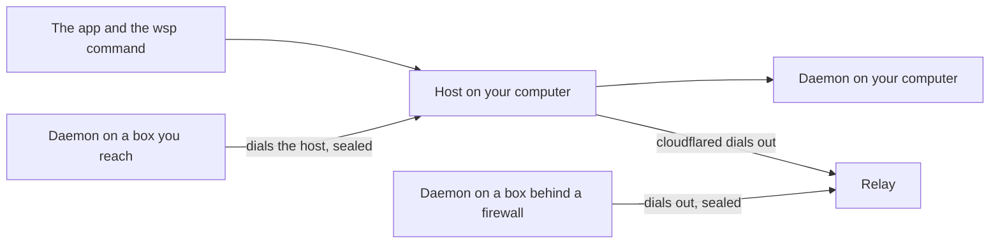

# The host, the daemon and the relay

wsp has three running parts. The host runs on the computer where you use the app. A daemon runs on every computer that wsp works on. The relay is a service that you need only when no one can reach your host from outside.

## The host

The host is the process that holds a state file and serves the app, the command line and the MCP tools. There is one host for each state file. It holds your keys and the records of your projects, threads, transcripts and computers. The app, the `wsp` command and the wsp tools in an agent are all clients of the same host. So a thread that an agent starts shows in your sidebar at once.

The host listens on `127.0.0.1:4400` by default. When a computer has joined, it also listens on a second port on every address, for the daemons of your other computers. That port is 20 above the app port, `4420` for the default `4400`. [The host](/how/host) says how it starts, stops and restarts.

## The daemon

The daemon is a Rust binary on every computer that wsp works on. It serves files, git, terminals and ports to the host. Once a box has joined, the host runs nothing on it over ssh. It asks the daemon there. Over ssh, the host runs only the scripts of an add, and of an update when the box's link is down.

On a box, the daemon runs as root under systemd. It listens only on the box's own loopback, and it dials out to the host. So the box needs no open port. First the two sides prove their keys to each other. The box knows the host's key from the add or the join line, and the host keeps the box's key. After that, they seal every frame between them (X25519, HKDF and AES-256-GCM).

The daemon has no telemetry and no update server of its own. A newer daemon comes only from your host, when you run `wsp add <name> --update`, and the box checks it by SHA-256 first. A daemon one version behind the host still works.

## The computers

A computer is a real computer that you own or sit at. wsp names three kinds:

- The computer that the app runs on. Threads here run in your project's folder, as you, on the agents on your `PATH`.
- A box: a Linux computer of your own, added with `wsp add user@host` over ssh, or joined with `wsp join` from the box itself. Threads there run in the project's folder on the box, as the login it was added with.
- Another device, such as a laptop or a phone, that opens the app on your host. It runs no daemon.

A project is a folder on one computer. Its threads run on that computer.

## How a box reaches the host

The daemon on a box always dials the host. It never waits for the host to dial it.

- A box on your network or with a public address is added over ssh. The box dials an address of your computer that it can reach. If it can reach none, the host holds an ssh reverse forward open, and the box dials back through it. See [A rented server](/guides/rented-server) and [A computer at home](/guides/home-computer).
- For a box behind a firewall that your computer cannot reach over ssh, you run `wsp join` on the box, and it dials the host's address. If your host has no address that the box can reach, link the host to the relay. The box then dials the relay's address for your host. See [A box behind a firewall](/guides/behind-a-firewall).

## The relay

The relay gives a host that no one can reach from outside an HTTPS address. It is a Cloudflare Worker with a small database, and each linked host runs Cloudflare's connector, `cloudflared`, which opens a tunnel out to Cloudflare. The relay is optional. wsp uses it only after you run `wsp host link` on the host's computer.

A Cloudflare tunnel ends TLS at Cloudflare. Frames between a box and the host stay sealed end to end, so Cloudflare sees only ciphertext of those. The app's own connection through the relay is not sealed in this way, so Cloudflare can read it. [What leaves your computer](/how/network) lists what the relay stores, and [Run your own relay](/guides/own-relay) shows how to run it on your own Cloudflare account.

## The agents

The agents are the coding agents that threads run: Claude Code, Codex, OpenCode and Cursor. On the computer that the app runs on, the host starts each agent's own command line itself, as a process of that computer. On a box, it starts the command through the daemon there. The agent talks to its own company under your sign-in. wsp does not sit between them. [How wsp runs each agent](/how/agents) has each launch line.
